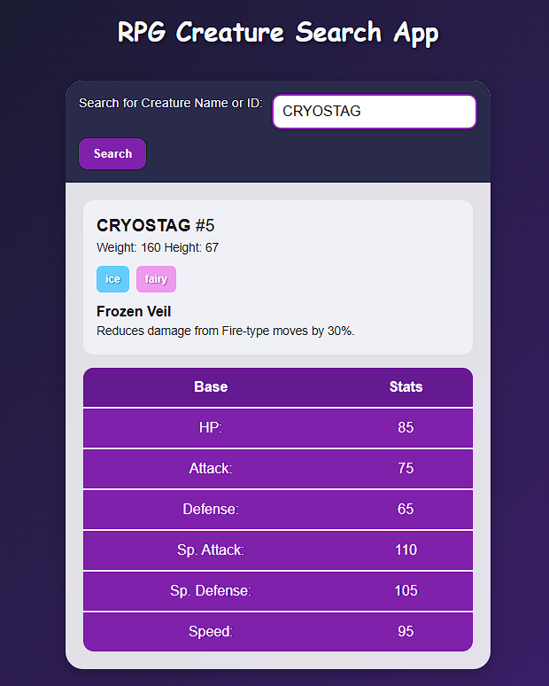

# 🐉 RPG Creature Search App

A simple web application that lets you search for RPG-style creatures by **name or ID** and view their details, including:

- 📛 Creature name and ID  
- ⚖️ Height & weight  
- 🎭 Special ability name and description  
- 🧬 Creature types (styled with colors)  
- 📊 Base stats (HP, Attack, Defense, etc.)  

The app fetches data from the **[freeCodeCamp RPG Creature API](https://rpg-creature-api.freecodecamp.rocks/)** and displays it in a clean, RPG-inspired interface.  

---

## 🚀 Features
- Search for creatures by **name or ID**  
- Dynamic UI updates with creature info  
- Styled type badges with unique colors  
- Responsive layout for desktop and mobile  
- Error handling for invalid creature names/IDs  

---

## 🛠️ Built With
- **HTML5** for structure  
- **CSS3** (custom + responsive styling)  
- **JavaScript (ES6)** for fetching and rendering API data  
- **freeCodeCamp RPG Creature API** as the data source  

---

## 📷 Preview


---

## 📦 Installation & Usage
1. Clone this repo:  
   ```bash
   git clone https://github.com/your-username/rpg-creature-search.git
